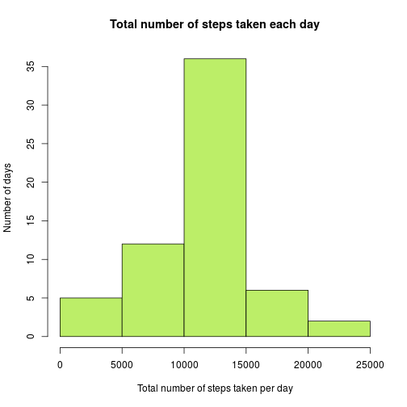

## Loading and preprocessing the data

*Loading packages necessary for analysis.*

```r
library(lubridate)
library(dplyr)
library(ggplot2)
```

*1. Loading data*


```r
dataURL <- "https://d396qusza40orc.cloudfront.net/repdata%2Fdata%2Factivity.zip"
temp <- tempfile()
download.file(dataURL, destfile = temp)
activity_data <- read.csv(unzip(temp))
rm(temp)

# check the loaded data
head(activity_data)
```

```
##   steps       date interval
## 1    NA 2012-10-01        0
## 2    NA 2012-10-01        5
## 3    NA 2012-10-01       10
## 4    NA 2012-10-01       15
## 5    NA 2012-10-01       20
## 6    NA 2012-10-01       25
```

```r
str(activity_data)
```

```
## 'data.frame':	17568 obs. of  3 variables:
##  $ steps   : int  NA NA NA NA NA NA NA NA NA NA ...
##  $ date    : Factor w/ 61 levels "2012-10-01","2012-10-02",..: 1 1 1 1 1 1 1 1 1 1 ...
##  $ interval: int  0 5 10 15 20 25 30 35 40 45 ...
```

*2. Process/transform the data into a format suitable for analysis*

The *date* column contains factors, which is not what we need in our analysis.
Let's transform the content into the *date* objects using the loaded *lubridate* package. In addition we will need to analyse data for each day and month separately. For convenience we can add 2 collumns: *day* and *month* containing the information about days and months respectively. 

```r
#check the class of date column before transformation
class(activity_data$date)
```

```
## [1] "factor"
```

```r
activity_data$date <- ymd(activity_data$date)
#check the class of date column after transformation
class(activity_data$date)
```

```
## [1] "Date"
```

## What is mean total number of steps taken per day?

*1. Calculate the total number of steps taken per day*

```r
compute_total_steps <- function(data){ 
    data %>% 
      group_by(date) %>% 
      summarize(total_steps_per_day = sum(steps, na.rm = TRUE))
}
total_steps <- compute_total_steps(activity_data)
# have a look at the result data frame
total_steps
```

```
## # A tibble: 61 × 2
##          date total_steps_per_day
##        <date>               <int>
## 1  2012-10-01                   0
## 2  2012-10-02                 126
## 3  2012-10-03               11352
## 4  2012-10-04               12116
## 5  2012-10-05               13294
## 6  2012-10-06               15420
## 7  2012-10-07               11015
## 8  2012-10-08                   0
## 9  2012-10-09               12811
## 10 2012-10-10                9900
## # ... with 51 more rows
```

*2. Make a histogram of the total number of steps taken each day*

```r
total_steps_hist <- function(data){
    hist(data$total_steps_per_day, xlim = c(0, 35000), xlab = "Total number of steps taken per day", ylab = "Number of days", main = "Total number of steps taken each day", col = "darkolivegreen2")
}
total_steps_hist(total_steps)
```


*3. Calculate the mean and median of the total number of steps taken per day*


```r
mean(total_steps$total_steps_per_day)
```

```
## [1] 9354.23
```

```r
median(total_steps$total_steps_per_day)
```

```
## [1] 10395
```

## What is the average daily activity pattern?

*1. Time series plot of the 5-minute interval (x-axis) and the average number of steps taken, averaged across all days (y-axis)*

```r
steps_per_interval <- activity_data %>%
  filter(!is.na(steps)) %>%
  group_by(interval) %>%
  summarize(average_number_of_steps = mean(steps)) 

steps_per_interval %>%
  ggplot(aes(x=interval, y=average_number_of_steps)) + geom_line(col = "blue") + xlab("Interval") + ylab("Average number of steps taken")
```


*2. Which 5-minute interval, on average across all the days in the dataset, contains the maximum number of steps?*

```r
max_num_steps <- max(steps_per_interval$average_number_of_steps)
idx_max <- which(steps_per_interval$average_number_of_steps == max_num_steps)
max_step_interval <- steps_per_interval$interval[idx_max]
```
The maximum number of steps (on average 206) contains the interval: 835 (which is consistent with the previous graph).

## Imputing missing values

*1. Calculate total number of missing values*

```r
na_num <- sum(is.na(activity_data))
na_step <- sum(is.na(activity_data$steps))
```
Total number of missing values in the dataset is 2304, which corresponds to the number of rows with missing step values equal 2304.

*2. Filling in all of the missing values in the dataset*

We can use the mean for that 5-minute interval to fill in the missing step values in the dataset.

*3. Creating a new dataset with the missing data filled in*


```r
#create a copy of the original dataset 
new_data <- activity_data
#have a look at the created copy (missing values are still there)
head(new_data)
```

```
##   steps       date interval
## 1    NA 2012-10-01        0
## 2    NA 2012-10-01        5
## 3    NA 2012-10-01       10
## 4    NA 2012-10-01       15
## 5    NA 2012-10-01       20
## 6    NA 2012-10-01       25
```

```r
for (i in 1:nrow(new_data)){
  if (is.na(new_data$steps[i])){
    interval_val <- new_data$interval[i]
    interval_idx <- which(steps_per_interval$interval == interval_val)
    new_data$steps[i] <- round(steps_per_interval$average_number_of_steps[interval_idx])
  }
}
#have a look at the new data again
head(new_data)
```

```
##   steps       date interval
## 1     2 2012-10-01        0
## 2     0 2012-10-01        5
## 3     0 2012-10-01       10
## 4     0 2012-10-01       15
## 5     0 2012-10-01       20
## 6     2 2012-10-01       25
```

```r
#how many missing values are there now?
sum(is.na(new_data))
```

```
## [1] 0
```

*4. Create a histogram of the total number of steps taken each day*


```r
new_total_steps <- compute_total_steps(new_data)
total_steps_hist(new_total_steps)
```



Calculate the mean and median of the total number of steps taken per day

```r
mean(new_total_steps$total_steps_per_day)
```

```
## [1] 10765.64
```

```r
median(new_total_steps$total_steps_per_day)
```

```
## [1] 10762
```

As we can see, the new values are different (both slightly higher) from those obtained before imputing the missing values. 

## Are there differences in activity patterns between weekdays and weekends?

*1. Create a new factor variable in the dataset with two levels – “weekday” and “weekend” indicating whether a given date is a weekday or weekend day*

```r
new_data$weekday <- as.factor(ifelse(wday(new_data$date) %in% c(1,7), "weekend","weekday"))
#there is now a new factor variable in the new_data:
str(new_data)
```

```
## 'data.frame':	17568 obs. of  4 variables:
##  $ steps   : num  2 0 0 0 0 2 1 1 0 1 ...
##  $ date    : Date, format: "2012-10-01" "2012-10-01" ...
##  $ interval: int  0 5 10 15 20 25 30 35 40 45 ...
##  $ weekday : Factor w/ 2 levels "weekday","weekend": 1 1 1 1 1 1 1 1 1 1 ...
```

*2. Time series plot of the 5-minute interval (x-axis) and the average number of steps taken, averaged across all weekday days or weekend days (y-axis)*

```r
new_data %>%
  group_by(weekday, interval) %>%
  summarize(average_number_of_steps = mean(steps)) %>%
  ggplot(aes(x=interval, y=average_number_of_steps)) + geom_line(col = "blue") + facet_grid(weekday~.) + xlab("Interval") + ylab("Average number of steps taken")
```


